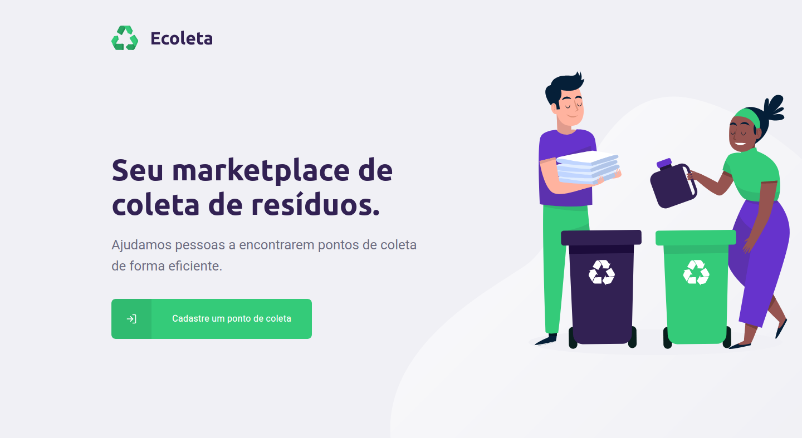

<!-- PROJECT LOGO -->
<br />
<p align="center">
  <a href="/">
    
  </a>

  <h3 align="center">Projeto Ecoleta</h3>

  <p align="center">
    Projeto desenvolvido durante a Next Level Week 1.0, ofertada pela  <a href="https://rocketseat.com.br/">Rocketseat</a>
    <br />
  </p>
</p>


<!-- ABOUT THE PROJECT -->
## Sobre o projeto

<p align="center">
  <a href="/">
    
  </a>

É uma plataforma completa para um marketplace de coleta de resíduos, composta por back-end, front-end e mobile.

* Back-end: Feito Typescript com NodeJS seguindo o modelo de API REST, com banco de dados SQLite.
* Front-end: Feito em Typescript com ReactJS, página web utilizada para o cadastro dos pontos de coleta.
* Mobile: Feito em Typescript com React Native, utilizado para encontrar os pontos de coleta próximos ao usuário, com base em sua localização e nos itens a serem coletados.

### Feito com
* [Typescript](https://www.typescriptlang.org/)
* [NodeJS](https://nodejs.org/)
* [ReactJS](https://reactjs.org/)
* [React Native](https://reactnative.dev/)
* [Expo](https://expo.io/)

<!-- GETTING STARTED -->
## Iniciando

### Pré requisitos

Como o projeto é feito em NodeJS, ReactJS e React Native(utilizando o expo) você precisa ter instalado:
* [NodeJS](https://nodejs.org/)
* [Expo](https://expo.io/)

### Instalação

1. Clone o repositório
```sh
git clone https://github.com/luizsetten/nlw-01
```
2. Instale os pacotes NPM
```sh
npm install
```
3. Para utilizar o front-end ou o mobile é necessário iniciar o back-end:

3a. Para iniciar o back-end:
```JS
cd server && npm run dev
```
3b. Para iniciar o front-end:
```JS
cd web && npm start
```
3c. Para iniciar o mobile:
```JS
cd mobile && npm start
```

<!-- CONTACT -->
## Contato

Luiz Gustavo Setten - [@luiz-setten](https://www.linkedin.com/in/luiz-setten/) 

Link do projeto: [https://github.com/luizsetten/nlw-01](https://github.com/luizsetten/nlw-01)
